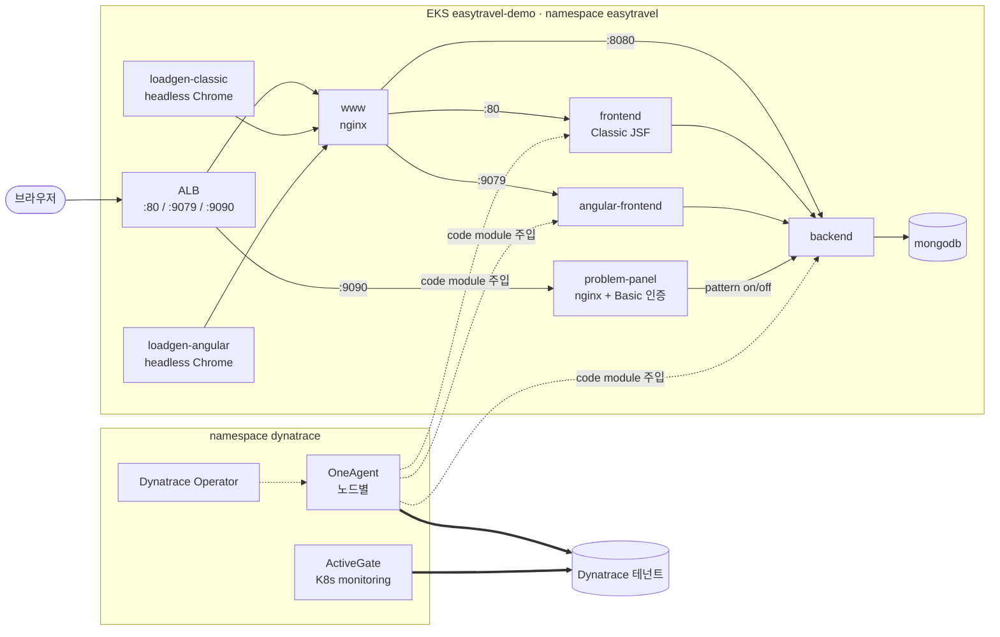
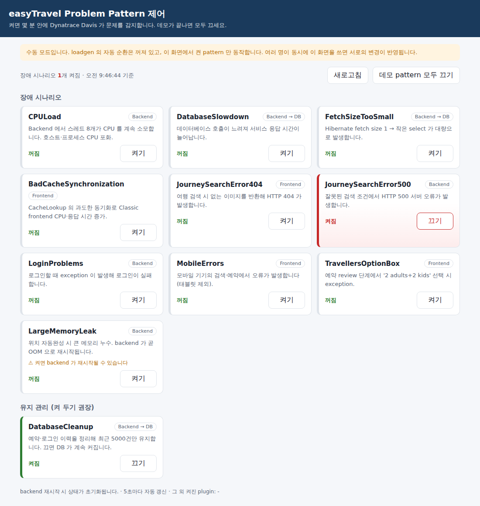

# easyTravel on Amazon EKS (한국어 데모)

Dynatrace 데모 애플리케이션 **easyTravel** 을 **Amazon EKS** 에 올리고 **Dynatrace Operator(cloudNativeFullStack)** 로 모니터링하는 데모 환경입니다. 데모 화면은 한글입니다.

- PowerShell 스크립트 하나(`up.ps1`)로 EKS 클러스터 생성부터 Dynatrace, easyTravel 배포까지 끝납니다. 데모가 끝나면 `down.ps1` 로 모두 지웁니다.
- Classic(JSF)과 Angular 두 가지 frontend, headless Chrome loadgen 2개, problem pattern 자동 순환이 포함됩니다.
- Dynatrace 에서 호스트·프로세스·서비스·분산 추적·RUM·Kubernetes 클러스터와 Davis problem 을 볼 수 있습니다.

## 실행 방식

| 방식 | 상태 | 비고 |
|---|---|---|
| **Amazon EKS** (`kubernetes/cluster/eks`) | ✅ 표준 | 이 README 의 모든 내용은 EKS 기준 |
| Azure AKS (`kubernetes/overlays/aks`) | ⚠️ 참고용 | 매니페스트만 있음. 미검증 |
| docker-compose (`docker-compose.yml`) | ❌ 사용 안 함 | upstream 원본. 영문 이미지, Dynatrace 연동 없음 → [docs/upstream-docker.md](docs/upstream-docker.md) |
| 로컬 PC / Codespaces | ❌ 사용 안 함 | Docker Desktop(WSL2)·kind 에서는 OneAgent cloudNativeFullStack 불가. 로컬 Linux VM 은 리소스 부족 |

## 빠른 시작 (EKS)

준비물: AWS CLI, eksctl, kubectl, helm, EKS 권한이 있는 AWS 프로필, Dynatrace **classic access token(`dt0c01.`)** 2개(Operator, Data Ingest).
도구 설치와 토큰 만드는 방법은 [`kubernetes/cluster/eks/README.md`](kubernetes/cluster/eks/README.md) 1장을 보세요.

PowerShell 에서 repo 루트로 이동한 뒤 한 줄씩 실행합니다.

```powershell
# 최초 1회: 환경 변수 파일 만들고 [CUSTOMIZE] 값 채우기 (커밋되지 않음)
Copy-Item .\kubernetes\cluster\eks\env.example.ps1 .\kubernetes\cluster\eks\env.local.ps1
notepad .\kubernetes\cluster\eks\env.local.ps1

# 새 PowerShell 창마다 (앞의 점 + 공백)
. .\kubernetes\cluster\eks\env.local.ps1

# 생성 (25~30분) → 마지막에 접속 주소 출력
powershell -ExecutionPolicy Bypass -File .\kubernetes\cluster\eks\up.ps1

# 삭제 (15~20분)
powershell -ExecutionPolicy Bypass -File .\kubernetes\cluster\eks\down.ps1
```

| 화면 | 주소 |
|---|---|
| Classic (JSF) | `http://<ALB 주소>/` |
| Angular | `http://<ALB 주소>:9079/` |
| Problem pattern 제어 패널 | `http://<ALB 주소>:9090/` (계정은 `up` 출력 참고) |

ALB 주소는 클러스터를 만들 때마다 바뀝니다. `kubectl -n easytravel get ingress` 로 확인하세요.

클러스터가 떠 있는 동안 EKS·EC2·NAT·ALB 요금이 시간 단위로 나옵니다. 데모가 끝나면 바로 `down` 하세요.

## 아키텍처



## 구성 요소

| Deployment | 이미지 | 역할 |
|---|---|---|
| `mongodb` | `ghcr.io/sacredna-dynatrace/easytravel-mongodb-ko` | 여행 데이터 DB (여행상품 이름·설명 한글) |
| `backend` | `dynatrace/easytravel-backend` | Business Backend (Java) |
| `frontend` | `ghcr.io/sacredna-dynatrace/easytravel-frontend-ko` | Classic Customer Frontend (Java JSF, 한글) |
| `angular-frontend` | `ghcr.io/sacredna-dynatrace/easytravel-angular-frontend-ko` | Angular Customer Frontend (한글) |
| `www` | `dynatrace/easytravel-nginx` | reverse proxy (80 Classic / 9079 Angular / 8080 Backend) |
| `loadgen-classic` | `ghcr.io/sacredna-dynatrace/easytravel-headless-loadgen-ko` | Classic 부하 (자동 순환 모드에서는 problem pattern 순환도 담당, Dynatrace 주입 제외) |
| `problem-panel` | `nginx:stable-alpine` | Problem pattern 웹 제어 (:9090, Basic 인증) |
| `loadgen-angular` | `ghcr.io/sacredna-dynatrace/easytravel-headless-loadgen-ko` | Angular 부하 (Dynatrace 주입 제외) |

`-ko` 이미지는 Docker Hub 원본 이미지를 한글로 패치한 것입니다. 만드는 방법은 [`i18n/README.md`](i18n/README.md) 를 보세요. 영문 화면이 필요하면 `kubernetes/overlays/eks/kustomization.yaml` 의 `../../components/korean` 줄을 주석 처리합니다.

## Dynatrace 에서 보이는 것

`up` 이 끝나고 5~10분 뒤 확인합니다.

- [ ] **Kubernetes** 앱: `easytravel` 클러스터, 노드 2대, easytravel namespace 워크로드
- [ ] **Hosts**: EKS 노드 2대 (host group `easytravel-demo`)
- [ ] **Services**: frontend, angular-frontend, backend 및 MongoDB 호출
- [ ] **Frontend (RUM)**: loadgen 이 만든 사용자 세션
- [ ] **Problems**: problem pattern 이 켜질 때 Davis problem

클러스터 이름은 `dynatrace/dynakube.yaml` 의 `automatic-kubernetes-api-monitoring-cluster-name` annotation 으로 정합니다.

## Problem pattern

기본 설정은 **웹 패널 모드**입니다. 데모 진행자가 `http://<ALB 주소>:9090/` 에서 장애 시나리오를 직접 켜고 끕니다 (Basic 인증). 계정은 `up` 출력에 표시됩니다.

| 모드 | 설정 (`overlays/eks/kustomization.yaml`) | 제어 |
|---|---|---|
| **웹 패널** (기본) | `problem-panel` | 브라우저 `:9090` + `kubernetes/problem.ps1` |
| 수동 | `problem-patterns-manual` | `kubernetes/problem.ps1 list / on / off / reset` |
| 자동 순환 | 둘 다 주석 처리 | `loadgen-classic` 이 `ET_PROBLEMS` 를 10분마다 하나씩 순환 |

### 사용법

**웹 패널** — 브라우저로 `http://<ALB 주소>:9090/` 접속 → 로그인 → 카드의 **켜기 / 끄기**. 데모가 끝나면 **데모 pattern 모두 끄기**.



**명령줄** — repo 루트의 PowerShell 에서:

```powershell
.\kubernetes\problem.ps1 list              # 켜짐/꺼짐 목록
.\kubernetes\problem.ps1 on  CPULoad       # 켜기 (대소문자 무관)
.\kubernetes\problem.ps1 off CPULoad       # 끄기
.\kubernetes\problem.ps1 reset             # 장애 시나리오 모두 끄기 (DatabaseCleanup 유지)
```

**데모 흐름 예시**

1. 패널에서 `CPULoad` 켜기
2. 3~10분 뒤 Dynatrace **Problems** 에서 Davis problem 확인 (root cause: backend 프로세스 CPU)
3. 패널에서 끄기 → problem 이 닫히는지 확인

**알아 둘 점**

- 패널 계정: 사용자 `demo`(또는 `PANEL_USER`), 비밀번호는 `PANEL_PASSWORD` 또는 처음 `up` 할 때 자동 생성되어 출력된 값
- 상태는 backend 메모리에 있어 backend Pod 가 재시작되면 초기 상태로 돌아갑니다
- 웹 패널·수동 모드에서는 켜기 전에는 장애가 발생하지 않습니다 (자동 순환 꺼짐)

### Pattern 목록

| Pattern | 증상 |
|---|---|
| CPULoad | Backend 에서 스레드 8개가 CPU 소모 → 호스트·프로세스 CPU 포화 |
| DatabaseSlowdown | 데이터베이스 호출 지연 → 응답 시간 증가 |
| FetchSizeTooSmall | Hibernate fetch size 1 → 작은 select 대량 발생 |
| BadCacheSynchronization | Classic frontend 의 `CacheLookup` 과도한 동기화 → CPU 증가 |
| JourneySearchError404 | 검색 시 없는 이미지 → HTTP 404 |
| JourneySearchError500 | 잘못된 검색 조건 → HTTP 500 |
| LoginProblems | 로그인 시 exception |
| MobileErrors | 모바일 기기 검색·예약 오류 |
| TravellersOptionBox | 예약 review 단계 '2 adults+2 kids' 선택 시 exception |
| LargeMemoryLeak | 큰 메모리 누수 → backend OOM 재시작 (웹 패널·수동 전용, 확인 후 실행) |
| DatabaseCleanup | 장애가 아닌 DB 정리 기능 (켜 두기 권장) |

모드 전환, 비밀번호 확인, 보안 설정은 [`docs/problem-patterns.md`](docs/problem-patterns.md) 를 보세요.

## 자주 바꾸는 설정 (`[CUSTOMIZE]` 주석)

| 항목 | 파일 |
|---|---|
| AWS 프로필, 테넌트 URL, 토큰 | `kubernetes/cluster/eks/env.local.ps1` (`env.example.ps1` 복사본) |
| 클러스터 이름·리전·노드 타입·개수 | `kubernetes/cluster/eks/cluster.yaml` |
| Dynatrace 클러스터 이름, host group, ActiveGate 리소스 | `dynatrace/dynakube.yaml` |
| 한글/영문, problem pattern 모드(웹 패널·수동·자동) | `kubernetes/overlays/eks/kustomization.yaml` |
| 웹 패널 계정 | `env.local.ps1` 의 `PANEL_USER` / `PANEL_PASSWORD` |
| 웹 패널 접속 허용 IP | `kubernetes/components/problem-panel/ingress.yaml` (`inbound-cidrs`) |
| ALB 접속 허용 IP | `kubernetes/overlays/eks/ingress.yaml` (`inbound-cidrs`) |
| 자동 순환 pattern 목록 | `kubernetes/base/configmap.yaml` (`ET_PROBLEMS`) |

## Repo 구조

```
├── kubernetes/
│   ├── cluster/eks/        ★ EKS 생성·삭제 스크립트 (up/down, cluster.yaml, env.example.ps1)
│   ├── base/               ★ easyTravel 매니페스트 (Kustomize)
│   ├── components/         ★ korean, problem-panel, problem-patterns-manual/delayed, mongodb-content-creator
│   ├── problem.ps1 / .sh   ★ problem pattern 명령줄 제어
│   └── overlays/eks/       ★ ALB Ingress   (overlays/aks 는 참고용)
├── dynatrace/dynakube.yaml ★ DynaKube v1beta6 cloudNativeFullStack
├── i18n/                   ★ 한글 이미지 빌드 (번역 리소스, 패치 도구, Dockerfile)
├── .github/workflows/      ★ i18n 추출·빌드·스모크 테스트
├── docs/upstream-docker.md   upstream README 번역 (참고용)
└── docker-compose.yml, build*.sh, images/, scripts/, kubernetes-manifests/
                              upstream 원본 보존 (이 repo 에서 사용·검증하지 않음)
```

## 문서

| 문서 | 내용 |
|---|---|
| [`kubernetes/cluster/eks/README.md`](kubernetes/cluster/eks/README.md) | EKS 준비·생성·확인·삭제·비용·문제 해결 (**먼저 볼 문서**) |
| [`kubernetes/README.md`](kubernetes/README.md) | Kustomize 구조, 기존 EKS 클러스터에 수동 배포, 원본 매니페스트 대비 변경점 |
| [`docs/problem-patterns.md`](docs/problem-patterns.md) | Problem pattern 웹 패널·명령줄·모드 전환·보안 |
| [`i18n/README.md`](i18n/README.md) | 한글 이미지 빌드 절차와 번역 범위 |
| [`docs/upstream-docker.md`](docs/upstream-docker.md) | upstream docker-compose·빌드 문서와 환경 변수 전체 목록 (참고용) |

## 출처·라이선스

[Dynatrace/easyTravel-Docker](https://github.com/Dynatrace/easyTravel-Docker) (MIT License) 를 기반으로 Kubernetes 배포, EKS 자동화, 한글화를 추가했습니다. 데모 목적의 개인 repo 이며 Dynatrace 공식 지원 대상이 아닙니다.
